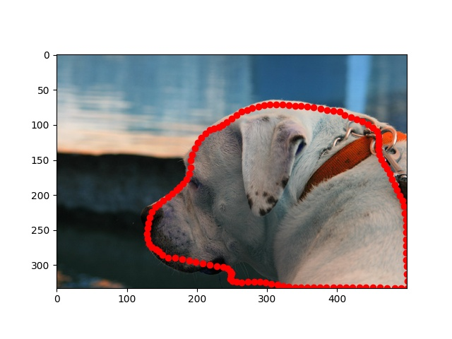

# 02507_Learn_based_curve_deformation

  

## Configuration

### Dataset
The Oxford-IIIT Pet Dataset: https://www.robots.ox.ac.uk/~vgg/data/pets/

The hdf5 dataset can be organized by the following
```bash
python ./data_utils/divide_dataset.py -ro 0.2 -rt /path/to/your/dataset/root
python data_utils/Oxford_utils.py -rt /path/to/your/dataset/root --organize
```

### Train
```bash
python ./train.py -dr /path/to/your/dataset/root -rn debug -bs 32
```
